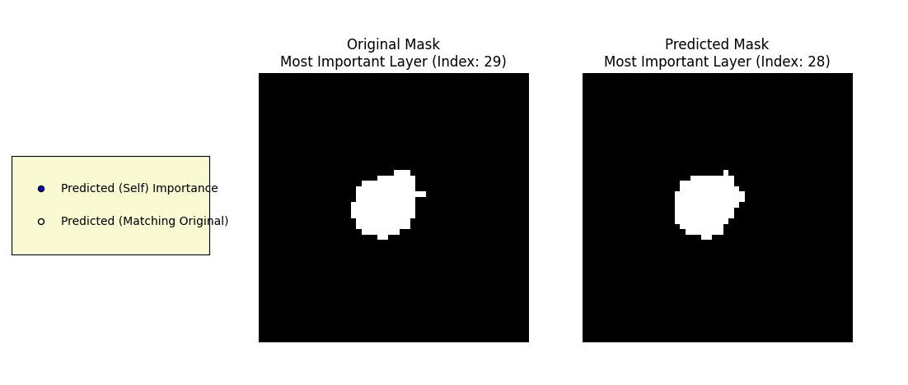

# Dental Canal Cbct


Teeth canal detection from CBCT 3D images using deep learning

## Table of Contents
- [🎯 Purpose](#-purpose)
- [✨ Features](#-features)
- [🛠️ Requirements](#%EF%B8%8F-requirements)
- [📁 Dataset](#-dataset)
- [🚀 Usage](#-usage)
  - [Dataset Conversion](#dataset-conversion)
  - [Configuration](#configuration)
  - [Training](#training)
  - [Prediction](#prediction)
  - [Reconstruct 3D Volumes](#reconstruct-3d-volumes)
- [📊 Prediction Demo](#-prediction-demo)
- [👋 Contributing](#-contributing)
- [📄 License](#-license)
- [🧑‍💻 Author](#%F0%9F%A7%A9-author)

---

## 🎯 Purpose
This project aims to first take raw images in DICOM (.dcm) and masks in NIFTI (.nii) format made by 3D Slicer program and create a dataloader for them. Secondly it uses these images, masks, and given ROI JSONs to train a deep learning model for segmentation and object detection.

## ✨ Features
*   **Models** supported
    *   UNet
*   **Dataset types**
    *   **BaseDataset**: Returns image, mask, bbox (bbox in format z, x, y, w, h, Z)
    *   **RegionalDataset**: Converts your dataset to segmented ROI boxes for your model to learn segmenting inside the boxes.

## 🛠️ Requirements
1.  Clone this repository.
    ```bash
    git clone https://github.com/monajemi-arman/dental-canal-cbct
    cd dental-canal-cbct/
    ```
2.  Make sure you have CUDA toolkit and NVIDIA drivers installed.
3.  Install the required python modules.
    ```bash
    pip install -r requirements.txt
    ```

## 📁 Dataset
Your dataset must be put in the `dataset` folder in the project directory and follow this structure:
```
dataset/
    -- first_image/
        -- roi_1_first_image.json
        -- roi_2_first_image.json
        -- ...
        -- first_image_dcm/
            -- first_image_001.dcm
            -- first_image_002.dcm
            -- ...
    -- second_image/
        -- ...
```
The dataset class in this project provides two types of loading data into the model:
*   **BaseDataset**: Returns `[image, mask, bounding boxes list]` for every image.
*   **RegionalDataset**: Crops image and mask based on the bounding box and returns the resulting `[image, mask]`.

## 🚀 Usage

### Dataset Conversion
Once your dataset is in the specified format, run the convert script to prepare numpy arrays of your images and masks along with a concise JSON of bounding boxes:
```bash
python convert.py
```

### Configuration
All the configs related to training, dataset conversion and split, transforms, and paths are saved in `config.json`. You may change these parameters as you wish. Make sure to remove the `all/` directory, `all.json`, `train.json`, `val.json`, and `test.json`, then re-run `convert.py` with the new config.

### Training
```bash
python train.py
```

### Prediction
```bash
python predict.py <path to checkpoint>
```

### Reconstruct 3D Volumes
*   [WIP]
```bash
python reconstruct_volumes.py -i all/images -m all/masks -a all.json -o all_nii
```

## 📊 Prediction Demo
We're still gathering clinical data; this prediction is when only data of 9 patients were gathered.


## 👋 Contributing
Contributions are welcome! If you have suggestions for improvements or new features, please open an issue or submit a pull request.

## 📄 License
This project is licensed under the MIT License - see the [LICENSE](LICENSE) file for details.
*(Note: You might need to create a LICENSE file in your project root if it doesn't exist.)*

## 🧑‍💻 Author
*   **Arman Monajemi** - [monajemi-arman](https://github.com/monajemi-arman)